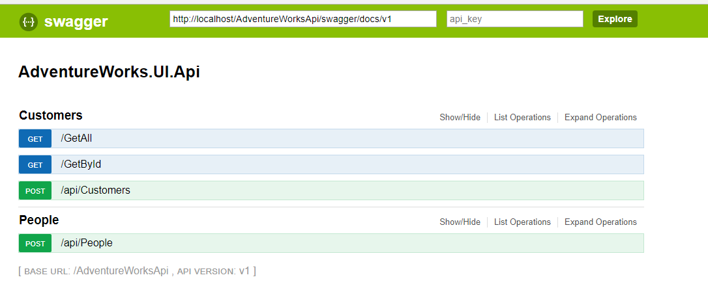
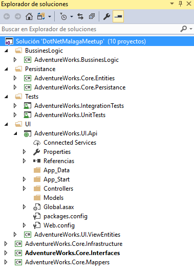

# Adventureworks project
> AdventureWorks API: example of good architecture, clean code, unit & integration tests.



## Introduction

This solution was part of the DotNetMalaga meetup: 

Recipes and tricks for your unit and integration tests in C#

https://www.meetup.com/es-ES/dotnetMALAGA/events/249769425/

## Architecture & nuget packages 



- Architecture: Domain Driven Design
- Persistance: Entity Framework 6, Pattern Repositories
- Api consume: Swagger
- Dependency Injection: Ninject
- Class Mapping: AutoMapper
- Mock: Moq
- Fake objects creator: AutoFixture
- Asserts: FluentAssertions
- Execute Startup: WebActivatorEX

## Requirements

1) Restore the database backup AdventureWorks:

[https://drive.google.com/open?id=11m-GxQ_TVAY76NGa1kU8H3YmaPJ_wORp](https://drive.google.com/open?id=11m-GxQ_TVAY76NGa1kU8H3YmaPJ_wORp)

```sh
RESTORE DATABASE AdventureWorks2017  
   FROM DISK = 'C:\TMP\AdventureWorks2017.bak' ; 
```

2) Use Visual Studio 2015, 2017 & enjoy

## Release History

* 0.0.1
    * First version

## Meta

Javier Garcia Martinez – [@javigm](https://twitter.com/javigm) – jagarciam@gmail.com

[https://github.com/viviab/AdventureWorks](https://github.com/viviab/AdventureWorks)

